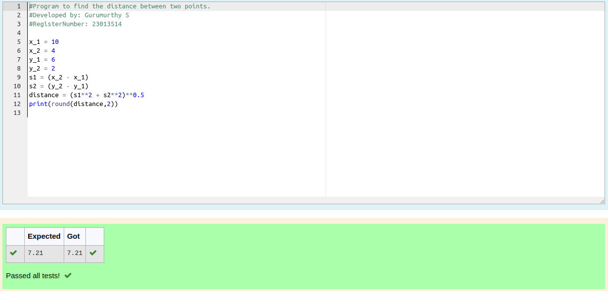

# DISTANCE-BETWEEN-TWO-POINTS

## AIM:
To write a python program to find the distance two 2 points
## ALGORITHM:

### Step 1: 
start the program

### Step 2: 
creat a variable distance of two distance

### Step 3: 
Substitute the values in the distance formula  

### Step 4: 
print the required output

### Step 5: 
End of the program

### PROGRAM:x_1 = 10
~~~python
x_1 = 10
x_2 = 4
y_1 = 6
y_2 = 2
s1 = (x_2 - x_1)
s2 = (y_2 - y_1)
distance = (s1**2 + s2**2)**0.5
print(round(distance,2))
~~~

### OUTPUT:

### RESULT:
Thus the python program to calculate the distance between two points has been executed successfully.